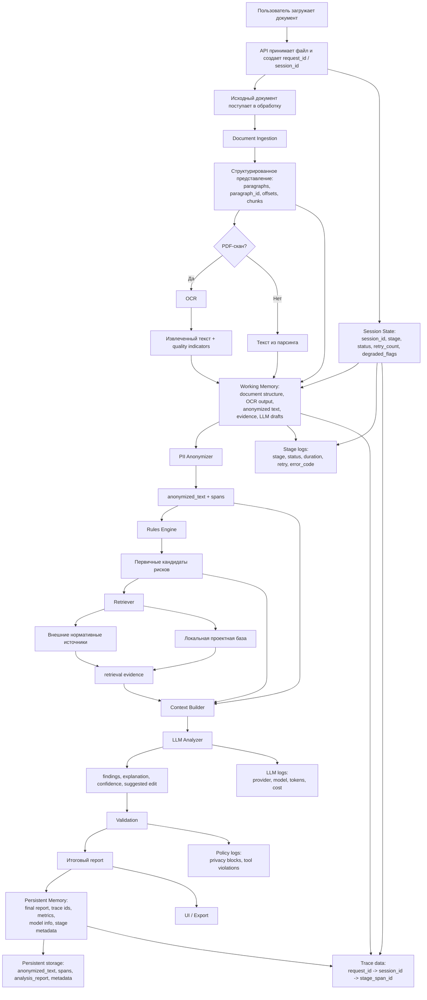

```mermaid
flowchart TD
    A[Пользователь загружает документ] --> B[API принимает файл и создает request_id / session_id]
    B --> C[Исходный документ поступает в обработку]
    B --> S1[Session State:
    session_id, stage, status, retry_count, degraded_flags]
    C --> D[Document Ingestion]
    D --> E[Структурированное представление:
    paragraphs, paragraph_id, offsets, chunks]

    E --> F{PDF-скан?}
    F -- Да --> G[OCR]
    G --> H[Извлеченный текст + quality indicators]
    F -- Нет --> I[Текст из парсинга]
    H --> J[Working Memory:
    document structure, OCR output,
    anonymized text, evidence, LLM drafts]
    I --> J
    E --> J
    S1 --> J

    J --> K[PII Anonymizer]
    K --> L[anonymized_text + spans]
    L --> M[Rules Engine]
    M --> N[Первичные кандидаты рисков]

    N --> O[Retriever]
    O --> P[Внешние нормативные источники]
    O --> Q[Локальная проектная база]
    P --> R[retrieval evidence]
    Q --> R

    R --> S[Context Builder]
    L --> S
    N --> S
    S --> T[LLM Analyzer]
    T --> U[findings, explanation, confidence, suggested edit]

    U --> V[Validation]
    V --> W[Итоговый report]

    W --> PM[Persistent Memory:
    final report, trace ids, metrics,
    model info, stage metadata]
    PM --> X[Persistent storage:
    anonymized_text, spans, analysis_report, metadata]
    W --> Y[UI / Export]

    S1 --> Z[Stage logs:
    stage, status, duration, retry, error_code]
    J --> Z
    T --> AA[LLM logs:
    provider, model, tokens, cost]
    V --> AB[Policy logs:
    privacy blocks, tool violations]
    S1 --> AC[Trace data:
    request_id -> session_id -> stage_span_id]
    J --> AC
    PM --> AC

```
