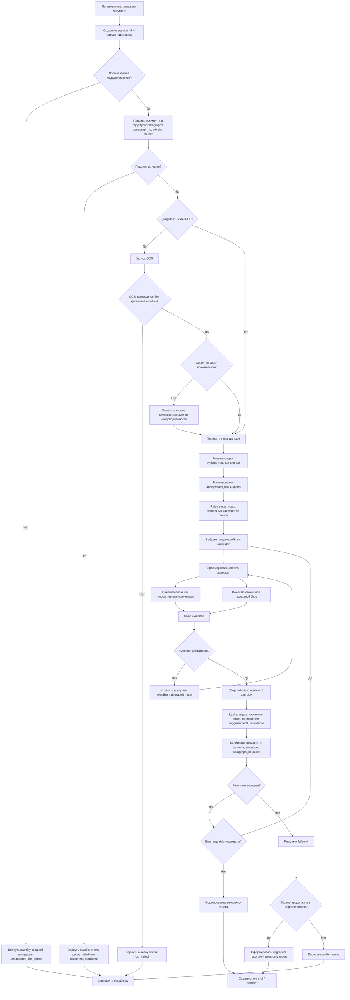

```mermaid
flowchart TD
    A[Пользователь загружает документ] --> B[Создание session_id и запуск пайплайна]
    B --> B1{Формат файла поддерживается?}
    B1 -- Нет --> B2[Вернуть ошибку входной валидации: unsupported_file_format]
    B1 -- Да --> C[Парсинг документа в структуру: paragraphs, paragraph_id, offsets, chunks]

    C --> C1{Парсинг успешен?}
    C1 -- Нет --> C2[Вернуть ошибку этапа: parse_failed или document_corrupted]
    C1 -- Да --> D{Документ - скан PDF?}

    D -- Да --> E[Запуск OCR]
    E --> E1{OCR завершился без критичной ошибки?}
    E1 -- Нет --> E2[Вернуть ошибку этапа: ocr_failed]
    E1 -- Да --> F{Качество OCR приемлемое?}
    F -- Нет --> G[Пометить низкое качество как фактор неопределенности]
    F -- Да --> H[Передать текст дальше]
    G --> H
    D -- Нет --> H

    H --> I[Анонимизация чувствительных данных]
    I --> J[Формирование anonymized_text и spans]

    J --> K[Rules stage: поиск первичных кандидатов рисков]
    K --> K1[Выбрать следующий risk-кандидат]
    K1 --> L[Сформировать retrieval-запросы]

    L --> M[Поиск по внешним нормативным источникам]
    L --> N[Поиск по локальной проектной базе]

    M --> O[Сбор evidence]
    N --> O

    O --> O1{Evidence достаточно?}
    O1 -- Нет --> O2[Уточнить query или перейти в degraded mode]
    O2 --> L
    O1 -- Да --> P[Сбор рабочего контекста для LLM]
    P --> Q[LLM analysis: уточнение риска, объяснение, suggested edit, confidence]

    Q --> R[Валидация результата: schema, evidence, paragraph_id, policy]
    R --> S{Результат валиден?}

    S -- Да --> S1{Есть еще risk-кандидаты?}
    S1 -- Да --> K1
    S1 -- Нет --> T[Формирование итогового отчета]
    S -- Нет --> U[Retry или fallback]

    U --> V{Можно продолжить в degraded mode?}
    V -- Да --> W[Сформировать degraded report или rules-only report]
    V -- Нет --> X[Вернуть ошибку этапа]

    T --> Y[Отдать отчет в UI / экспорт]
    W --> Y
    B2 --> Z[Завершить обработку]
    C2 --> Z
    E2 --> Z
    X --> Z
```
